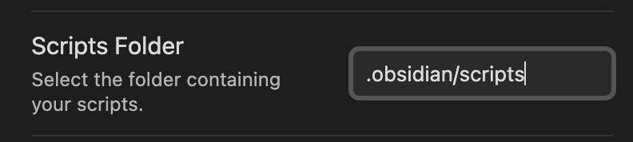
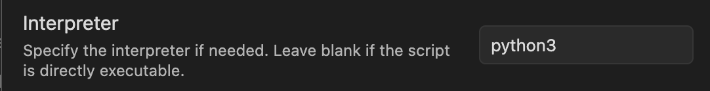
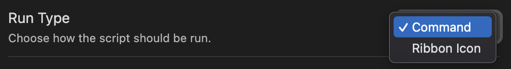

# Obsidian Python Scripter

## Archived

Use [obsidian-shellcommand](https://github.com/Taitava/obsidian-shellcommands) instead

## Summary 

This is a program to quickly allow you to run your own Python scripts from inside Obsidian. To get started enable this plugin, it will create a scripts/python folder inside your designated .obsidian folder. For each script it will add a custom command to the obsidian commands panel.

## Requirements

- Install your preferred version of python and make sure it functions from the command line eg: ```python .obsidian/scripts/python/main.py```
- This plugin works with naked python scripts eg. scripts/python/example.py
- Or you may want a more complicated script, you can have a folder as a script. You just need to have a main.py file inside of a src folder for it to function as a command, otherwise it will not be able to execute. Make sure to structure the scripts/python as follows
<pre>
  scripts
    |
    ---- python
           |
           ---- example
                  |
                  ---- src
                        |
                        ---- main.py
                        |
                        ---- hello.py
</pre>

   Your resulting scripts folder should have a structure like the following:
  <pre>
  scripts
    | 
    ---- python
           | 
           ---- example 
           |       | 
           |       ---- src 
           |             | 
           |             ---- main.py 
           |             | 
           |             ---- hello.py 
           | 
           ---- example2.py 
</pre>

 ## Obsidian Directions 

 - Add your python scripts in the format specified in the requirements section.
 - Once Obsidian starts, your commands will be added to the commands window and can be run as you would like.
 - If Obsidian is already open it will need to be **Restarted** when first added but not after that
 - In the above example, there would be 2 commands added:
 	- Run example
  	- Run example2.py


  
 ## Plugin Direction

This plugin passes 2 optional arguments to the script, argument 1 is the absolute path to the obsidian root folder, argument 2 is the path to the open file if it is open, otherwise an empty path is sent
e.g. ```python \Users\nick\Documents\Vault\.obsidian\scripts\python\main.py \Users\nick\Documents\Vault dir1\file1.md```

More optional arguments can be added, as well as the ability to prompt the user for arguments.

These can be used by the script as liked.

Here is a starting point for a python script: main.py

```python
# main.py
import sys
import os

python_script = sys.argv[0]
file_path = sys.argv[2]
vault_path = sys.argv[1]

abs_file_path = os.path.abspath(os.path.join(vault_path, file_path))

print(f"This is the open file: {abs_file_path}")
```

### Environment

If you don't want to add secrets directly to your scripts, you can store them elsewhere in an environment file, which can then be imported at run time.

Example Env File:
```
SECRET_PASSWORD=supersecretword
OTHER_PASSWORD=password
```

## Settings

You have the ability to change the default python script location in settings. Additionally you have the ability to change the default python executable, or can configure python executables per script if you would like to use virtual environments. i.e. Python Exe: C:\Users\nickr\Documents\Projects\Scratch\.venv\Scripts\python.exe

## Debugging

If your script fails to run. An error is shown in the top right of obsidian and in the *developer console* which can be found with the following  hotkeys: "ctrl" + "shift" + "i" on Windows, or "cmd" + "option" + "i" on MacOS.

## 1.1.x Migration

If you are upgrading the 1.1.x, the changes from 1.0.x are breaking. 
- You can set the script base path in settings, but it must be from the root of the vault, .obsidian/scripts is default:

- You have to set the python interperter (or other interpreter manually for each script)

- You have to set the run method manually for each script


